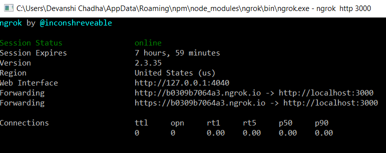

VIT APPOINTMENTS

A mobile application where professors and students can create and select
appointment slots for important interactions, developed using MERN
(MongoDB, Express API, React Native, NodeJS) stack development.

TABLE OF CONTENTS

INTRODUCTION

TECHNOLOGIES

SETUP

USAGE

INSPIRATION

SUPPORT

INTRODUCTION

In today\'s world there are a lot of important clarifications and
interactions that students and professors need to make with each other.
This can be done thorough proper creation and documentation of
appointments with their appropriate details available to both students
and professors. VIT APPOINTMETS is a mobile application where professors
can enter their free slots with proper timings and venues and the
students can browse through these slots to make an appointment. The
appointment details will be made available to both students and
professors. The mobile application is made using React Native for
front-end and Express API connected to the mongoDB. The API is made
available to user\'s mobile using ngrok.

TECHNOLOGIES

React \--react\@16.9.0

Expo \--expo\@36.0.2

Express \--express\@4.17.1

Mongoose \--mongoose\@5.8.11

Jsonwebtoken \--jsonwebtoken\@8.5.1

Bcrypt \--bcrypt\@5.0.0

Ngrok- 2.3.35

SETUP

1\. To install react and run the React Native metro Bundler run the
following commands inside a project workspace through git bash:

\$ npm install -g expo-cli

\$ npx install expo-cli

Change into the project directory

\$ npm install react-navigation

\$ expo-cli start

2\. In order to setup express API and connect it to mongoDB run the
following commands in server directory through git bash:

\$ npm install bcrypt express jsonwebtoken mongoose

3\. To setup ngrok change to the project directory and rung the
following command:

\$ npm install -g ngrok

USAGE

We change into the server directory and fire up our API so that it\'s
listening on port 3000 and is connected to mongoDB instance.

{width="6.0in" height="1.3333333333333333in"}

Now to make our express API available not only to local computer but
also to user mobile we use ngrok.

{width="6.0in" height="4.833333333333333in"}

{width="6.0in" height="2.3833333333333333in"}

We take this forwarding URL and use it as base URL in our axios instance
of frontend. We run the React Native Metro Bundler to get a QR code. We
can scan this QR code through Expo App from Play Store and use the
mobile application.

{width="6.0in" height="4.325in"}

{width="5.266666666666667in" height="4.95in"}

{width="6.0in" height="2.7416666666666667in"}

The mobile application will run on the user\'s android/ios mobile as
shown in the video demo of this project.

INSPIRATION

The mobile application is inspired from the manual accounting and
creation of appointments which was previously done by receptionists and
employees. As the world gets more digitized, people want everything on
their phones and creation/selection of university appointments should be
made easily available to the students and professors.

SUPPORT

Contact the developer at: devanshichadha\@gmail.com
